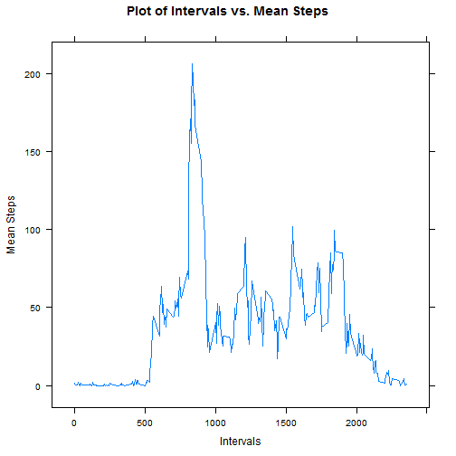
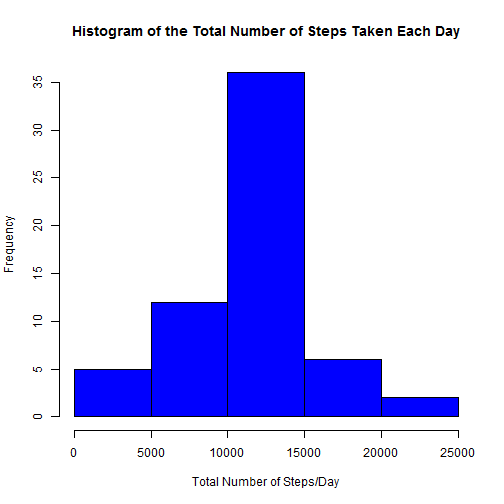
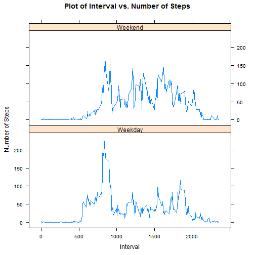

# Reproducible Research: Peer Assessment 1

```r
# Required Libraries:
library(plyr)
library(lattice)
```


## Loading and preprocessing the data

```r
# you need to unzip the data in the current working directory
activity <- read.csv("activity.csv", header = TRUE, sep = ",")
dim(activity)
```

```
## [1] 17568     3
```

```r
names(activity)
```

```
## [1] "steps"    "date"     "interval"
```

```r
length(unique(activity$date))  # there are 61 days in the dataset.
```

```
## [1] 61
```

```r
table(activity$date, useNA = "ifany")  # there are 288 observations related to each day.
```

```
## 
## 2012-10-01 2012-10-02 2012-10-03 2012-10-04 2012-10-05 2012-10-06 
##        288        288        288        288        288        288 
## 2012-10-07 2012-10-08 2012-10-09 2012-10-10 2012-10-11 2012-10-12 
##        288        288        288        288        288        288 
## 2012-10-13 2012-10-14 2012-10-15 2012-10-16 2012-10-17 2012-10-18 
##        288        288        288        288        288        288 
## 2012-10-19 2012-10-20 2012-10-21 2012-10-22 2012-10-23 2012-10-24 
##        288        288        288        288        288        288 
## 2012-10-25 2012-10-26 2012-10-27 2012-10-28 2012-10-29 2012-10-30 
##        288        288        288        288        288        288 
## 2012-10-31 2012-11-01 2012-11-02 2012-11-03 2012-11-04 2012-11-05 
##        288        288        288        288        288        288 
## 2012-11-06 2012-11-07 2012-11-08 2012-11-09 2012-11-10 2012-11-11 
##        288        288        288        288        288        288 
## 2012-11-12 2012-11-13 2012-11-14 2012-11-15 2012-11-16 2012-11-17 
##        288        288        288        288        288        288 
## 2012-11-18 2012-11-19 2012-11-20 2012-11-21 2012-11-22 2012-11-23 
##        288        288        288        288        288        288 
## 2012-11-24 2012-11-25 2012-11-26 2012-11-27 2012-11-28 2012-11-29 
##        288        288        288        288        288        288 
## 2012-11-30 
##        288
```

```r
sapply(activity[1, ], class)  # Obtaining the class of each variable.
```

```
##     steps      date  interval 
## "integer"  "factor" "integer"
```

```r

# changing the class of the variable 'steps' to be Numeric:
activity$steps <- as.numeric(activity$steps)
# changing the class of the variable 'interval' to be Numeric:
activity$interval <- as.numeric(activity$interval)
activityData <- activity[complete.cases(activity), ]  # new data frame after removing NAs.
```


## What is mean total number of steps taken per day?

```r
# obtaining the total number of steps for each day:
sm <- ddply(actData, c("date"), function(x) apply(x[1], 2, sum))
hist(sm$steps, xlab = "Total Number of Steps/Day", main = "Histogram of the Total Number of Steps Taken Each Day", 
    col = "red")
```

 

```r

# obtaining the mean of total steps:
mean(sm$steps, na.rm = TRUE)  # 10766.19
```

```
## [1] 10766
```

```r
# obtaining the median of total steps:
median(sm$steps, na.rm = TRUE)  # 10765
```

```
## [1] 10765
```


## What is the average daily activity pattern?

```r
# Calculating the mean of steps related to each interval:
mnsteps <- ddply(actData, c("interval"), function(x) apply(x[1], 2, mean))

# Creating the panel plot containing a time series plot of the 5-minute
# interval and the average number of steps taken, averaged across all days:
xyplot(mnsteps$steps ~ mnsteps$interval, type = "l", ylab = "Mean Steps", xlab = "Intervals", 
    main = "Plot of Intervals vs. Mean Steps", lwd = 1.5)
```

 

```r
max(mnsteps$steps)  # what is the maximum amount of mean steps
```

```
## [1] 206.2
```

```r
# obtaining the interval related to the maximum of mean step (interval 835):
mnsteps[mnsteps$steps == max(mnsteps$steps), ]
```

```
##     interval steps
## 104      835 206.2
```


## Imputing missing values

```r
sum(is.na(activity$interval))  # without NA.
```

```
## [1] 0
```

```r
sum(is.na(activity$date))  # without NA.
```

```
## [1] 0
```

```r
sum(is.na(activity$steps))  # There are 2304 rows with NAs.
```

```
## [1] 2304
```

```r

# replacing the steps of the rows having NAs with the mean steps for each
# 5-min interval across the all data:
mnsteps <- ddply(actData, c("interval"), function(x) apply(x[1], 2, mean))
newData <- activity
newData[1:288, 1] <- mnsteps$steps
newData[2017:2304, 1] <- mnsteps$steps
newData[8929:9216, 1] <- mnsteps$steps
newData[9793:10080, 1] <- mnsteps$steps
newData[11233:11520, 1] <- mnsteps$steps
newData[11521:11808, 1] <- mnsteps$steps
newData[12673:12960, 1] <- mnsteps$steps
newData[17281:17568, 1] <- mnsteps$steps
sum(is.na(newData))  # There is no NA.
```

```
## [1] 0
```

```r
# Calculating the sum of steps related to each day:
newsm <- ddply(newData, c("date"), function(x) apply(x[1], 2, sum))

# Creating the histogram of the total number of steps taken each day This
# histogram is slightly different from the previous one which was created
# before filling the NAs. This histogram has higher frequency around mean
# steps:
hist(newsm$steps, xlab = "Total Number of Steps/Day", main = "Histogram of the Total Number of Steps Taken Each Day", 
    col = "blue")
```

 

```r

# obtaining the mean of total steps after filling in all NAs: the mean is
# exactly the same as before. Imputing missing data did not have majore
# impact on the estimates of the total daily number of steps.
mean(newsm$steps)  # 10766.19
```

```
## [1] 10766
```

```r
# obtaining the median of total steps after filling in all NAs: The median
# was increased very slightly and is now equal to the mean. Imputing missing
# data did not have majore impact on the estimates of the total daily number
# of steps.
median(newsm$steps)  # 10766.19
```

```
## [1] 10766
```


## Are there differences in activity patterns between weekdays and weekends?

```r
# Adding new column to the dataset 'newData' containing the week days'names:
newData$WD <- weekdays(as.Date(newData$date))
# Replacing the names of week day with 'Weekday' and 'Weekend':
newData$WD[newData$WD == "Friday"] <- "Weekday"
newData$WD[newData$WD == "Monday"] <- "Weekday"
newData$WD[newData$WD == "Thursday"] <- "Weekday"
newData$WD[newData$WD == "Tuesday"] <- "Weekday"
newData$WD[newData$WD == "Wednesday"] <- "Weekday"
newData$WD[newData$WD == "Saturday"] <- "Weekend"
newData$WD[newData$WD == "Sunday"] <- "Weekend"
table(newData$WD)
```

```
## 
## Weekday Weekend 
##   12960    4608
```

```r

# Creating the panel plot containing a time series plot of the 5-min
# interval and the average number of steps taken, averaged across all
# weekday days or weekend days.
newmnsteps <- ddply(newData, c("interval", "WD"), function(x) apply(x[1], 2, 
    mean))
xyplot(newmnsteps$steps ~ newmnsteps$interval | newmnsteps$WD, type = "l", ylab = "Number of Steps", 
    xlab = "Interval", main = "Plot of Interval vs. Number of Steps", layout = c(1, 
        2))
```

 


